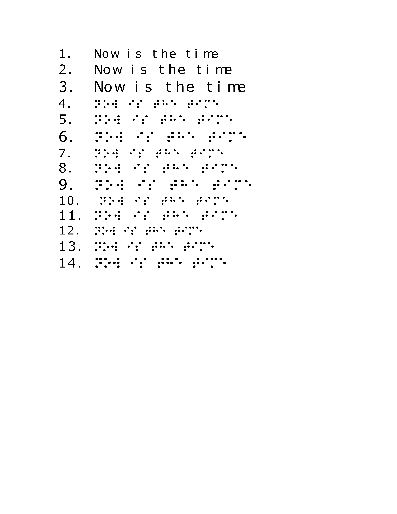

# Printing a Tactile Diagram from a PDF

This example walks through the steps required to print a tactile diagram
with braille text from a pdf.

You can find the starting pdf diagram [here](resources/braille-font-test.pdf).

## Generate a .SVG file from PDF

You will need inkscape installed on your system

Create an alias for inkscape that points to the applications executable

### Windows
```
Set-Alias
```
Then follow the prompts adding inkscape for the name and the path to the executable for the path

### Mac/Linux
```
alias inkscape="/Applications/Inkscape.app/Contents/Resources/bin/inkscape"
```

Run
```
inkscape braille-font-test.pdf -o braille-font-test.svg
```

Great! We now have an SVG file!


## Convert the text in the SVG file to braille

You'll need to have the vision-impaired-printing directory on your path to run this command. 
This creates a new .svg file that has the text replaced with uncontracted braille. You will only
need this option if you do not have text or already have braille in your pdf.

```
$ svg-braille-converter.sh -i addition.svg 
```

Your browser may have trouble rendering this SVG file. Inkscape opens it happily for me. We skipped this
in the following example as most of the file was already in braille and we needed some text to be printed as well.

## Create a bitmap from the svg file or directly from the pdf if you skipped the braille generation step

InkScape is the best tool I have found for doing this. ImageMagick has a SVG to PNG conversion capability, but I have
not found it to be reliable. 

I like to use 600dpi. 

```
inkscape --pdf-poppler .\braille-font-test.pdf -o .\braille-font-test.png  --export-dpi=600 --export-background=#ffffff
```

The pdf-poppler flag keeps inkscape from converting any braille font back to text if the font is missing form your system
the export-background flag keeps the background of the exported image white.

Here's the resulting PNG file:



## Create an SCAD model from the bitmap

OpenSCAD is 3d modeling tool. Generate an SCAD file by running:

```
python bitmap_to_scad.py -i doc/examples/pdf/resources/braille-font-test.png -x 200 -y 200 -s 6 -r 600
```

The parameters to this command are:

* `-i` Specifies the input file
* `-x 200` limits the resulting model to 200mm in the x dimension
* `-y 200` limits the resulting model to 200mm in the y dimension
* `-s 6` slices the bitmap into a six by six grid to eliminate closed polygons

## Render the 3d model.
You can do this step either via the command line or by opening openscad
You will need to either set an alias like before for inkscape or add openscad command line application to your environments path.

### Rendering in OpenSCAD
Open the resulting .scad file in OpenSCAD, then press the render button. 

Your model will disappear for a little bit, this is normal. 

#### Export a .stl file

In OpenSCAD, select File -> Export -> STL

### Rendering via command line
```
openscad -o ./braille-font-test.stl ./doc/examples/pdf/resources/braille-font-test.scad
```

This process may take a while...
Here's the [resulting file](braille-font-test.stl)

## Generate a .gcode file

Drag the STL file into Ultimaker Cura


Apply the following custom print settings.

## Print

Before you can print, you have to set up the paper on your printer. 
This is discussed over in [Printing Tips](../../printing-tips.md).


