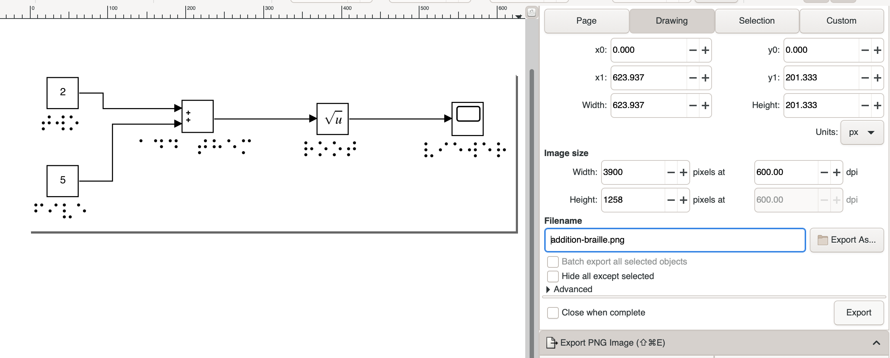
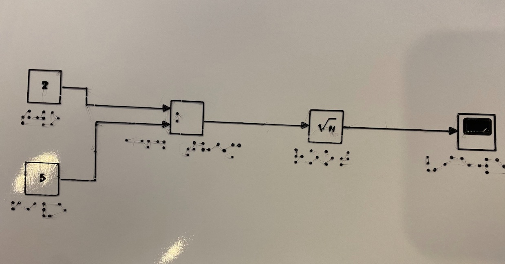

# Printing a Tactile Diagram from Simulink

This example walks through the steps required to print a tactile diagram
with braille text from a Simulink model.

You can find the starting Simulink diagram [here](resources/addition.slx).
If you don't have Simulink, you can follow this tutorial
with any SVG file (just skip the Simulink steps).

## Formatting in Simulink
If you start with the default Simulink formatting, it will look
something like this:


This font size is too small for clean conversion to braille,
so the first step is to increase the font size to 24 and switch to a monospace font like courier new.


## Generate a .SVG file from Simulink

Next, we need to export a Scalable Vector Graphics (SVG) file from Simulink. 
You can do this via the Matlab shell. The diagram must be open in Simulink when you run this command.

```
>> print('-saddition','-dsvg','addition.svg')
```

Great! We now have an SVG file!


## Convert the text in the SVG file to braille

You'll need to have the vision-impaired-printing directory on your path to run this command. 
This creates a new .svg file that has the text replaced with braille. 

```
$ svg-braille-converter.sh -i addition.svg 
```

Here's the resulting SVG file:

[Simulink SVG with generated braille](resources/addition-braille.svg)

Your browser may have trouble rendering this SVG file. Inkscape opens it happily for me. 

## Create a bitmap from the SVG file

InkScape is the best tool I have found for doing this. ImageMagick has a SVG to PNG conversion capability, but I have
not found it to be reliable. 



I like to use 600dpi. 

Here's the resulting PNG file:


## Create an SCAD model from the bitmap

OpenSCAD is 3d modeling tool. Generate an SCAD file by running:

```
$ bitmap-to-scad.sh -i addition-braille.png -x 200 -y 200 -s 6
```

The parameters to this command are:

* `-i` Specifies the input file
* `-x 200` limits the resulting model to 200mm in the x dimension
* `-y 200` limits the resulting model to 200mm in the y dimension
* `-s 6` slices the bitmap into a six by six grid to eliminate closed polygons

Here's the output (with some lines removed):

```
Python 3.9.9
Parsing image addition-braille.png
Input image dimensions: (1258, 3900, 3)
Image width 3900 image height 1258
Using split 6
Found 116 contours
Scaling to maximum X span 200mm, maximum Y span 200mm, resolution Nonemm, and height 0.2mm.
Using scale factor 0.0524mm per pixel
Scaling model based on -x (--xmax) constraint of 200mm maximum horizontal size.
Generated SCAD file: addition-braille.scad
```

bitmap-to-scad reports that the x dimension constraint (200mm) was the limiting factor that it used
to scale the model. 

## Render the 3d model.

Open the resulting .scad file in OpenSCAD, then press the render button. 

If you couldn't generate it, you can also find the SCAD file [here](resources/addition-braille.scad)


Your model will disappear for a little bit, this is normal. 

## Export a .stl file

In OpenSCAD, select File -> Export -> STL


Here's the [resulting file](resources/addition-braille.stl)

## Generate a .gcode file

Drag the STL file into Ultimaker Cura


Apply the following custom print settings:

| Setting | Value |
| ------ | ------ |
| Print Thin Walls | True |
| Build Plat Temperature | 65.0 c |
| Enable Retraction | True | 
| Z Hop When Retracted | True | 
| Z Hop Height | 1.0 mm | 


Click Slice to generate a gcode file. [Here is what I generated](resources/CE3PRO_addition-braille.gcode).

## Print

Before you can print, you have to set up the paper on your printer. 
This is discussed over in [Printing Tips](../../printing-tips.md).

## Enjoy! 

If your paper stayed flat on the print bed, you should have a pretty nice tactile diagram! 

Mine isn't quite perfect (note the thin tendrils of filament left when the extruder lifts up). 
I'll update this guide as I improve the settings.




# Legal

Copyright 2022 Adventium Labs
Licensed under the Apache License, Version 2.0 (the "License");
you may not use this file except in compliance with the License.
You may obtain a copy of the License at

http://www.apache.org/licenses/LICENSE-2.0

Unless required by applicable law or agreed to in writing, software
distributed under the License is distributed on an "AS IS" BASIS,
WITHOUT WARRANTIES OR CONDITIONS OF ANY KIND, either express or implied.
See the License for the specific language governing permissions and
limitations under the License.
