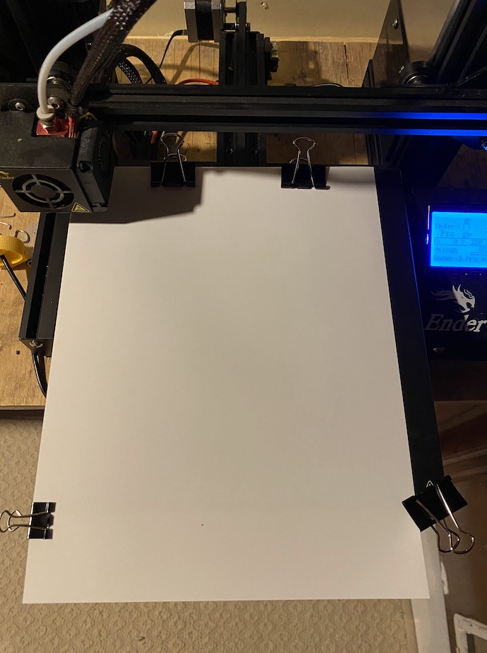

# This project has moved!

It's now at https://github.com/tactile-graphics/3d-printing-tools

----------

# Printing Tips

# Paper Type
Tyler has had good results with Canon Photo Paper Glossy (GP-701)

# Printer Type
Tyler uses an Ender 3 Pro

# Paper Placement
Tyler uses paper clips at the edges of the printer bed to hold the paper in place. Tape also works, but it leaves residue.

# Print Dimensions
* Use 0.2mm height. Any additional layers increase the likelihood that the extruded material will break off when touched.

# Print Settings
Tyler uses Ultimaker Cura for printer configuration. The screenshots are from version 4.12.1

## General Settings

| Setting | Value |
| ------ | ------ |
| Printing Material | PLA | 
| Tool Temp | 200c |
| Bed Temp | 65c |

## Special Settings

### Z-Hop

Use the z-hope option. This helps avoid blurred lines between dots in braille characters. I set the hope distance to at least 0.5mm (you need to go into the custom settings sub-menu to enable the z-hope height option).

### Thin Walls

Turn on Print Thin Walls to avoid losing fine lines. Again, this is a custom setting you may have to turn on.

# Legal

Copyright 2022 Adventium Labs
Licensed under the Apache License, Version 2.0 (the "License");
you may not use this file except in compliance with the License.
You may obtain a copy of the License at

http://www.apache.org/licenses/LICENSE-2.0

Unless required by applicable law or agreed to in writing, software
distributed under the License is distributed on an "AS IS" BASIS,
WITHOUT WARRANTIES OR CONDITIONS OF ANY KIND, either express or implied.
See the License for the specific language governing permissions and
limitations under the License.
